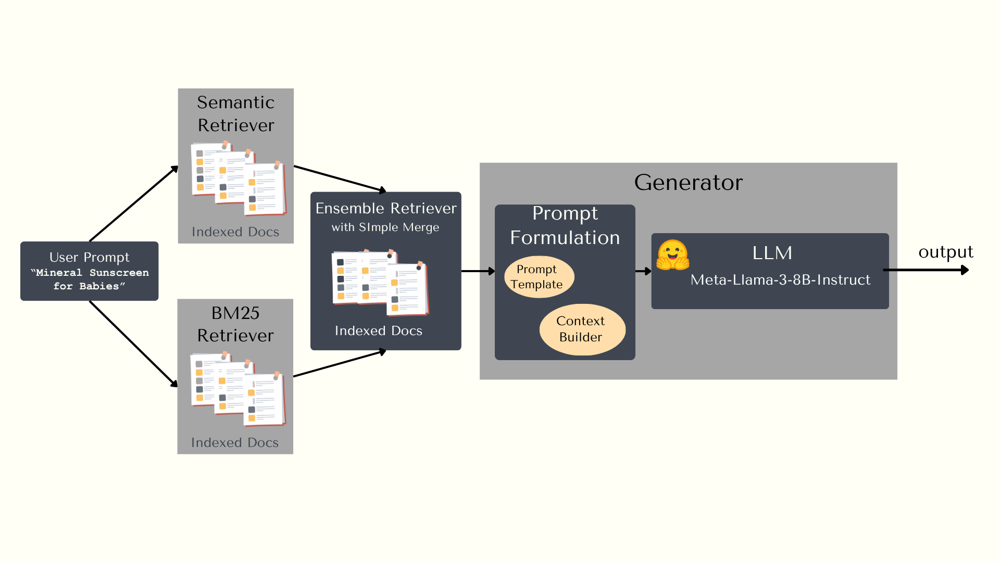

# DSCI_575_project_claudia-liauw_cynthiaagata

## Building a Smart Amazon Product Query Assistant

In this project, we built a context-aware product search assistant that returns relevant Amazon products from the Health and Personal Care category based on natural language queries. We compared keyword retrieval with BM25 and semantic retrieval with pre-trained embeddings and FAISS. In addition, we incorporate a Large Language Model (LLM) with Retrieval-Augmented Generation (RAG) to generate more context-aware and natural responses by combining retrieved product information with generative capabilities.

### Data

The data used is from [https://amazon-reviews-2023.github.io/](https://amazon-reviews-2023.github.io/). It consists of review data and metadata about the products. As the dataset is very large, we limited the number of rows to 20000.

### Preprocessing

We only retained records where the name of the product (`product_title`) is available. We build the corpus from the following fields from the metadata: `product_title`, `main_category`, `store`, and the `title` and `text` from reviews data.

For preprocessing, we removed stop words, tokens that are shorter than two characters, irrelevant parts of speech, no vector (out of vocabulary), and any non-alphabetic characters. We lemmatized the words and converted them to lowercase.

### Retrieval Workflows

#### BM25

BM25 is an enhanced TF-IDF (term frequency-inverse document frequency) vectorization. Each document (product comprising metadata and review data) is represented by a vector of the same length as the vocabulary (sparse) with TF-IDF scores for each word. This is saved as an index.

At retrieval time, the query is vectorized in the same way, and BM25 calculates a score for each document. We retrieve the top k documents with the highest scores.

#### Semantic

Each document is represented as a dense vector of pre-trained embeddings. This is saved as an index with FAISS. 

At retrieval time, the query is vectorized in the same way and the FAISS index is used to perform approximate nearest neighbour search to retrieve the top k similar documents.

## RAG 

### Model Selection
The initial choice of the model was prototyped with Qwen3.5-0.8B, as it is lightweight. However, the performance was poor with a lot of repeated results. Then, we switched to `Meta-Llama-3-8B-Instruct` via HuggingFace API. Instruct models are tuned to follow instructions. We chose an 8B model as it is a good balance between performance and latency. The choice is good as we do not need additional storage for our laptop.

### RAG Workflow with Semantic Retriever
The RAG workflow with semantic retrieval uses the FAISS-based dense retriever to find the top k most semantically similar documents to the user query. These retrieved documents are then passed as context to the LLM (`Meta-Llama-3-8B-Instruct`), which generates a coherent and context-aware response based solely on the semantic search results.

### Hybrid RAG Workflow
The Hybrid RAG workflow combines BM25 and semantic retrieval into an ensemble retriever using weighted scoring (BM25: 0.4, Semantic: 0.6), leveraging the strengths of both keyword matching and semantic similarity to retrieve the most relevant documents. The retrieved documents are then passed to the LLM (`Meta-Llama-3-8B-Instruct`) along with the user query and a structured prompt, which instructs the model to generate a natural language product recommendation grounded in the retrieved review content.

### Hybrid RAG Workflow Diagram



### Note on functions
Retriever functions (`semantic_retriever`, `bm25_retriever`, `hybrid_retriever`) return retriever objects. This is more modular and allows the output of the functions to be directly fed into `initialize_rag_chain`. To obtain a ranked list of documents, call `retriever.invoke(<query>)`.

Similarly, `initialize_rag_chain` returns a RAG chain. To obtain results, call `rag_chain.invoke(<query>)`. Both semantic and hybrid RAG use this function with a different `retriever` input.

## Instructions

### Setup

**Prerequisites:** Python 3.9 or higher

1. Clone the repo

Option 1 (Need to input your GitHub username and Personal Access Token for the password):
```bash
git clone https://github.com/UBC-MDS/DSCI_575_project_cliauwyt_cea
```
Option 2 (Use your SSH key):
```bash
git clone git@github.com:UBC-MDS/DSCI_575_project_cliauwyt_cea.git
```
Note: for option 2 you need to have SSH set up with GitHub first

2. Head to the project repository folder
```bash
cd DSCI_575_project_cliauwyt_cea
```

3. Create and activate a virtual environment
```bash
python -m venv env
# On Windows:
env\Scripts\activate
# On macOS/Linux:
source env/bin/activate
```

4. Install dependencies
```bash
pip install -r requirements.txt
python -m spacy download en_core_web_md
```

5. Download the data: run the notebook `notebooks/download_data.ipynb`.
```bash
jupyter execute notebooks/download_data.ipynb
```

Expected output files:

```text
data/raw/meta_raw.parquet
data/raw/reviews_raw.parquet
data/raw/merged.parquet
```

#### BM25 and semantic indices

1. To preprocess and save the data (overwrites existing file): 
```bash
python src/preprocess.py
```

2. To build and save BM25 index (overwrites existing file):
```bash
python src/bm25.py
```

3. To build and save semantic index (overwrites existing file):
```bash
python src/semantic.py
```

(Optional) Run the notebook `notebooks/milestone1_results.ipynb` to preprocess and save the data, and build and save BM25 and semantic indices:
```bash
jupyter execute notebooks/milestone1_results.ipynb
```

Expected output files:

```text
data/processed/clean_data.csv
data/processed/preprocessed_corpus.csv
data/processed/bm25.pkl
data/processed/embedding.faiss
```

#### RAG

**Prerequisites:** `data/processed/preprocessed_corpus.csv`

1. HuggingFace API key: log into HuggingFace account and create a `read` token. Go to your profile > Settings > Access Tokens > Create new token > Select `Read` Token type > name your token > Create token. More information can be found in [here](https://huggingface.co/docs/hub/security-tokens).

2. GitHub Models key: create a GitHub personal access token (PAT) with access to GitHub Models. Go to GitHub > Settings > Developer settings > Personal access tokens > Tokens (fine-grained) > Generate new token > Add permissions > Search for "Models" and select it > Generate token.

3. Tavily API key: create an account at [Tavily](https://tavily.com/) and generate an API key from your dashboard.

4. Paste all required keys into `.env` at the project root:

```env
HUGGINGFACEHUB_API_TOKEN=<YOUR_HUGGINGFACE_TOKEN>
GITHUB_TOKEN=<YOUR_GITHUB_TOKEN>
TAVILY_API_KEY=<YOUR_TAVILY_API_KEY>
```

5. Build and save vector store (overwrites existing files): 
```bash
python src/vectorstore.py
```

Expected output directory:

```text
data/processed/vector_store/
```

6. To run RAG pipeline:
```bash
python src/rag_pipeline.py "<query>"
```

7. To run hybrid RAG pipeline:
```bash
python src/hybrid.py "<query>"
```

### Run the app

**Prerequisites:**

1. Preprocessed data: `data/processed/preprocessed_corpus.csv`
2. BM25 index: `data/processed/bm25.pkl`
3. Semantic index: `data/processed/embedding.faiss`
4. Vector store: `data/processed/vector_store/`
5. HuggingFace API key in `.env` (`HUGGINGFACEHUB_API_TOKEN`)
6. GitHub Models key in `.env` (`GITHUB_TOKEN`)
7. Tavily API key in `.env` (`TAVILY_API_KEY`)


1. Start the Shiny app:

```bash
shiny run app/app.py
```

2. Open the local URL shown in the terminal (typically `http://127.0.0.1:8000`).
