# Final Discussion

## Step 1: Improve Your Workflow

### Dataset Scaling

-   Number of products used: 13332

-   Changes to sampling strategy: none.

    We used the original strategy with DuckDB to limit the number of rows, so the whole data does not materialise in memory. Hence, the raw size is only a few MB (\~3-9MB).

### LLM Experiment

-   **Models compared (name, family, size)**

    Our original model was `Llama-3-8B-Instruct` from from the Llama 3 (Meta) family with size 8B parameters. We are comparing it with a second model `Qwen3-8B` from the Qwen family with size 8B parameters.

-   **Results and discussions**

    -   **Prompt used:**

        "You are a helpful Amazon shopping assistant. Answer the question using ONLY the following context (real product reviews + metadata). Always cite the product ASIN when possible.

        Customer Reviews: {context}

        Question: {query}

        Answer based on the reviews above:"

    -   **Results**

        -   **Query 1: Bar Soap**
            -   LLM 1: `Llama-3-8B-Instruct`

                

            -   LLM 2: `Qwen3-8B`

                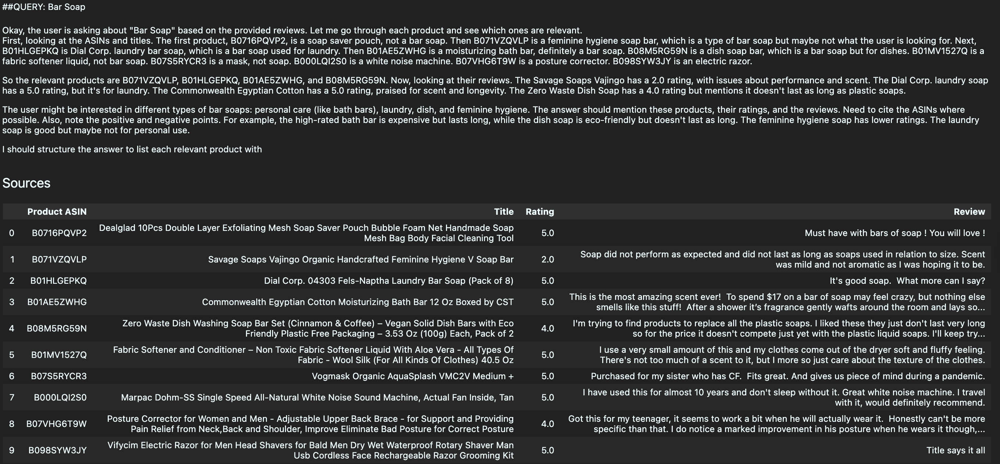

                For searching bar soap product, LLM 2 performed better by returning only relevant bar soap recommendations and acknowledging that the soap pouch is not a bar soap. However, LLM 2 was not confident with the hygiene soap bar which would be actually useful for user's intent. LLM 1, on the other hand, included a soap pouch as its first recommendation, which is an accessory rather than the product itself.
        -   **Query 2: Hairspray**
            -   LLM 1: `Llama-3-8B-Instruct`

                

            -   LLM 2: `Qwen3-8B`

                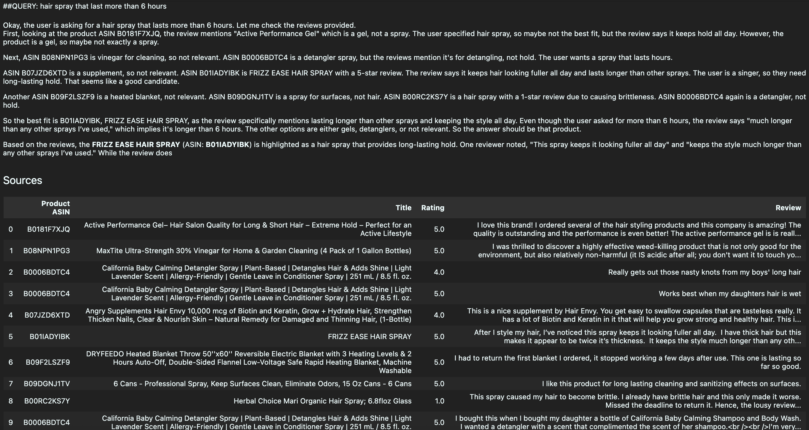

                Both models recommended the same primary product (Frizz Ease Hair Spray). The performance for the two LLMs are equal for this query.
        -   **Query 3: Humidifier**
            -   LLM 1: `Llama-3-8B-Instruct`

                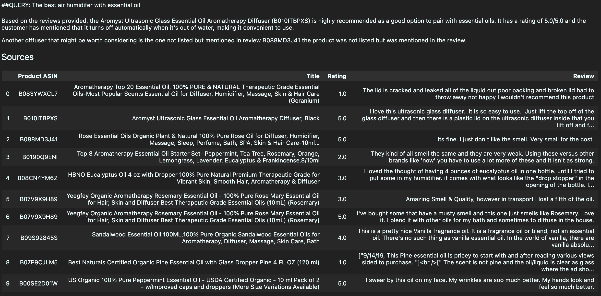

            -   LLM 2: `Qwen3-8B`

                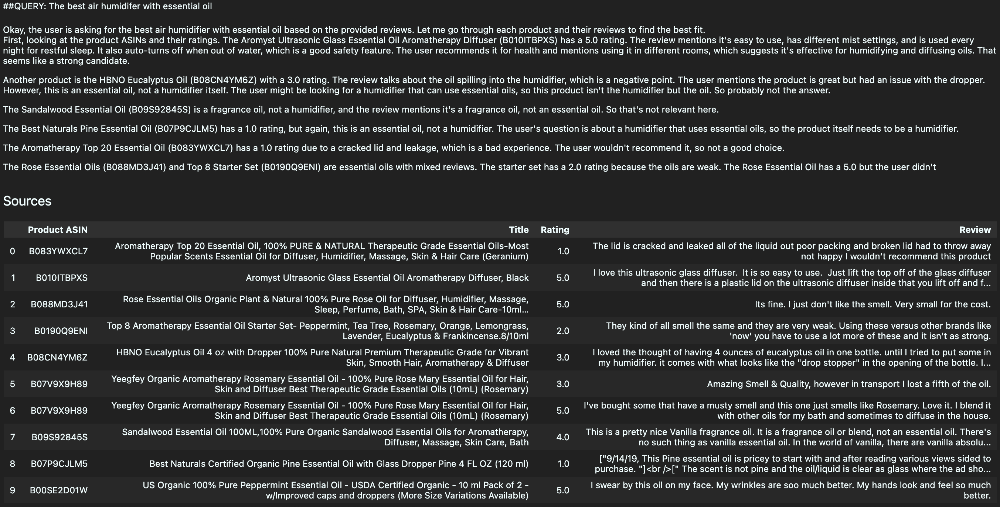

                Both models returned the same diffuser recommendations which is the Aromyst Ultrasonic Glass Diffuser which is very relevant to user's intent. However, LLM 2 kept listing irrelevant essential oil products and notably acknowledged their irrelevance, suggesting a tendency to over-generate rather than staying focused on the query.
        -   **Query 4: Lamp**
            -   LLM 1: `Llama-3-8B-Instruct`

                

            -   LLM 2: `Qwen3-8B`

                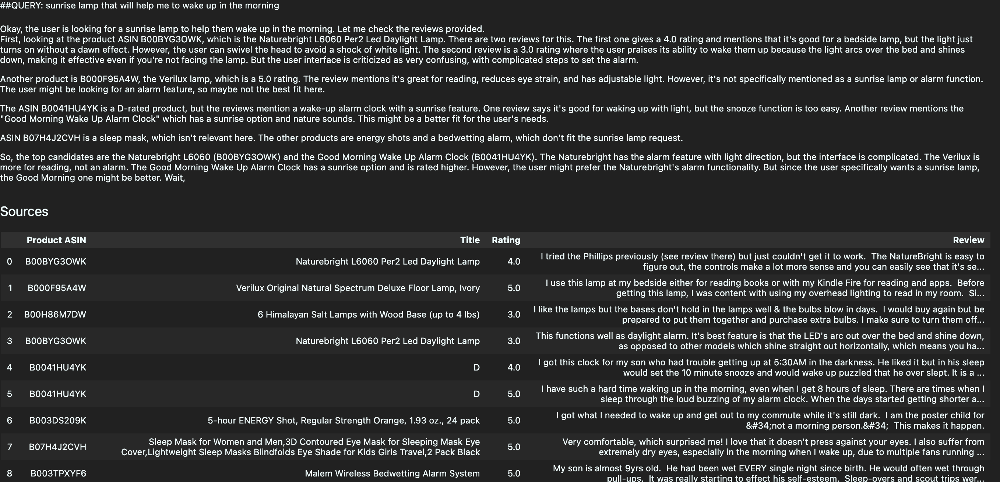

                Both models recommend a daylight lamp that reviewers confirmed works as a daylight alarm, which is directly matching the user's intent of finding a lamp that aids in waking up. LLM 2 recommended further products that are not actual lamps, like alarm clocks, and suggesting more duplicates.
        -   **Query 5: Sunscreen**
            -   LLM 1: `Llama-3-8B-Instruct`

                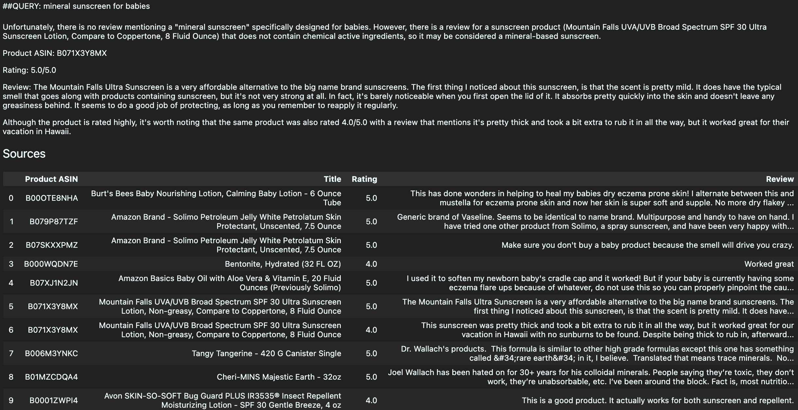

            -   LLM 2: `Qwen3-8B`

                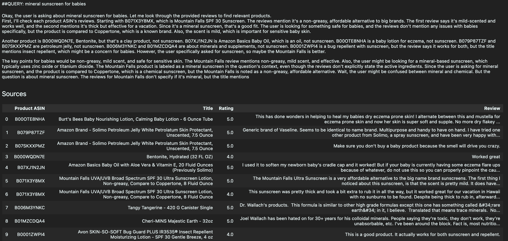

                Both LLMs suggested Mountain Falls Sunscreen which is an accurate sunscreen product to recommend for top choice. Nonetheless, both models failed to find a sunscreen suitable for babies, suggesting a limitation in the retrieved context rather than the models themselves. Again, the additional products LLM 2 suggesting are not relevant/accurate anymore for our query.

-   **Which model we chose and why**

    We selected LLM 1 (`Llama-3-8B-Instruct`) as our default model. Across the five queries, Llama demonstrated better precision and more relevant enough recommendations overall without over-generating. LLM 1 is better at keeping the result concise compared to LLM 2.

## Step 2: Additional Feature (Tool Integration)

### What You Implemented

-   **Description of the feature**

    To extend the pipeline beyond static document retrieval, web search functionality was integrated using Tavily. Both the RAG retriever and the web search tool are exposed as tools to the agent. The agent is instructed to always prioritize the RAG tool for product-related queries, and use the web search tool when the user requests current or real-time information. This allows the pipeline to ground its responses in both curated product reviews and up-to-date external information.

-   **Three Key results or examples**

    1. What soap is trending right now

    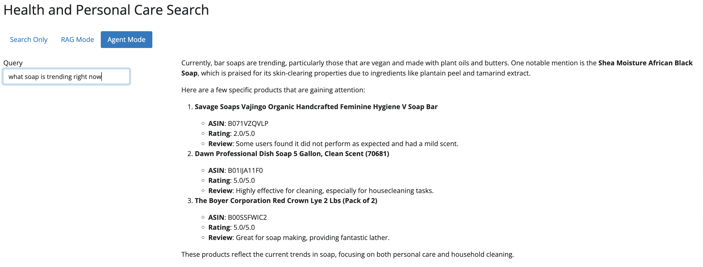

    It seems that the agent failed to call the web-search tool instead of RAG tool for retrieving "what soap is trending right now".

    2. What soap is famous right now

    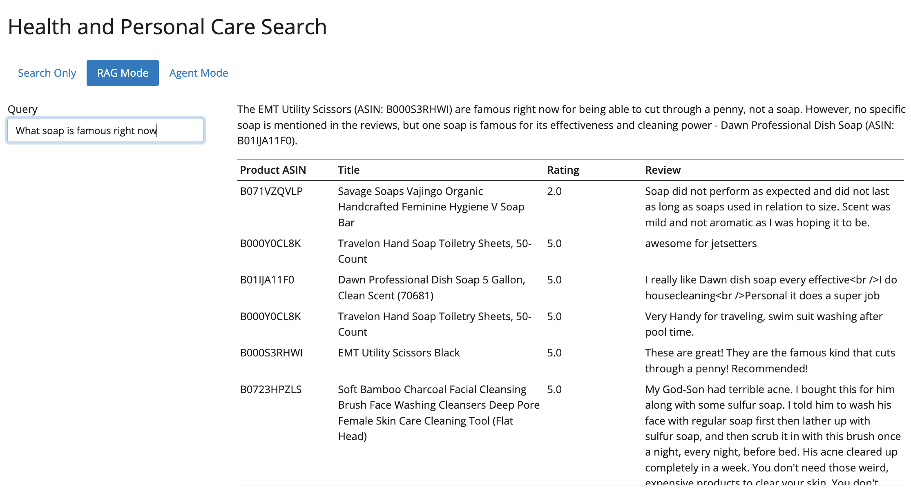

    Here is an example of a regular RAG tool query result to compare with Agent Mode.

    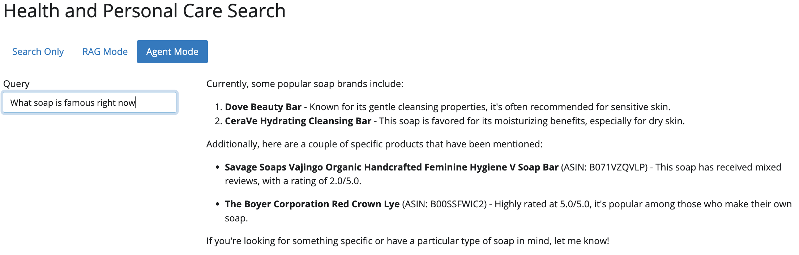

    For this query, the agent succeeded to call the web-search tool to retrieve some real-time information about current popular soaps. Interestingly, the agent also called the RAG tool to retrieve some products from our data set, which is similar to using RAG mode (except the Boyer Lye product).

    3. Is there any recalled sunscreen in 2025

    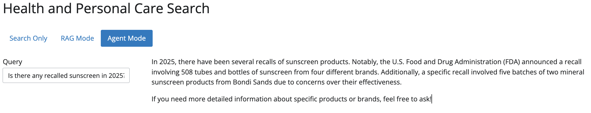

    The agent was able to explain if there were any recalled sunscreens in 2025 from recent articles.

-   **Explain whether it improved the results**

    The web-search tool improves the results by adding real-time information which would be out of the scope of our original data set. As a result, the response becomes less static and more flexible since we are not relying on a static data set. However, for standard product recommendation queries, the web search tool adds little benefit over pure RAG since both would recommend the same products from the data set. Additionally, the agent's ability to select the right tool for the right query is critical to overall performance.

## Step 3: Improve Documentation and Code Quality

### Documentation Update

-   Added description for tool implementation
-   Added set up information on how to acquire Tavily API key and access the Agent mode for our App
-   usage examples??????

### Code Quality Changes

-   Moved file paths into config file
-   API key already not in code
-   Added docstrings to new functions (to verify)
-   Updated environment file (to verify)
-   .gitignore already updated

## Step 4: Cloud Deployment Plan

1.  Data Storage: Where will you store the following?

    -   raw data

    -   processed data

    -   vector index

    -   BM25 index

    All data and indexes will be stored in S3, then we can load them into EC2 when app starts. This way we can have cheap and scalable object storage that is easy to retrieve and update.

2.  Compute

    -   Where will your app run?

    -   How will you handle multiple users (concurrency)?

    -   How will you handle LLM inference (API vs hosted model)?

    EC2, Spark?

3.  Streaming/Updates

    -   How will you incorporate new products in production?

    -   How will your pipeline stay up to date?
