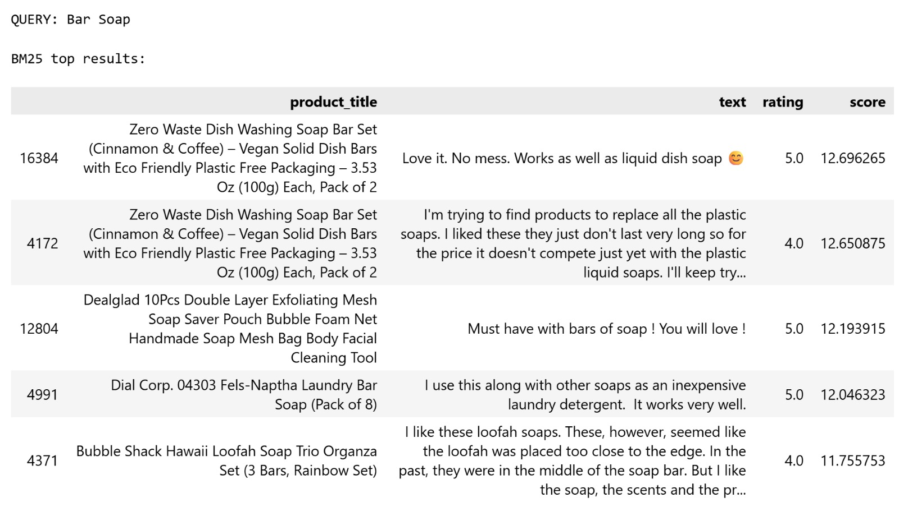
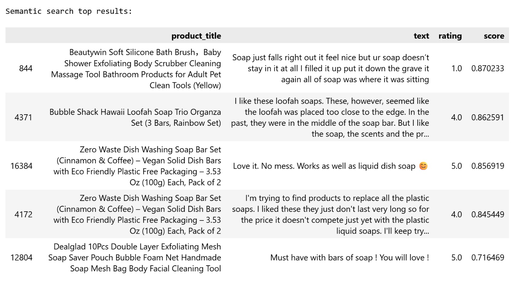
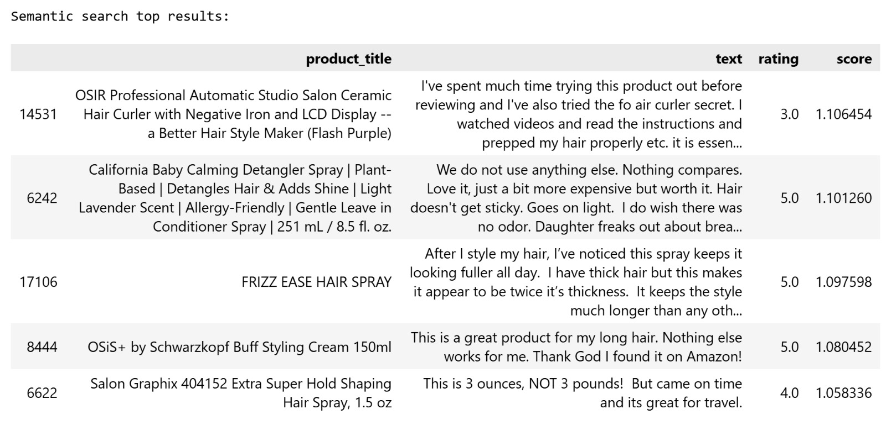

# Query Picks

### 1. QUERY: Bar Soap (Easy Query)

 

For the query "Bar Soap", BM25 performed slightly better compared to
semantic search. For the user's intent, the top 2 results from BM25
returned relevant bar soap products (though they were duplicates of the
same product), whereas the semantic search's top 2 results were not
relevant, returning loofah soap products instead of bar soap.

Both methods seemed to confuse "bar soap" appeared in review text versus
in the product title as loofah soap products receive quite high scores.
This is expected considering our method is to combine both review text
and product title into one product text, which likely caused the loofah
soap mix-up. This confusion was more pronounced in semantic search,
where loofah soap received higher relevance scores than in BM25.

In terms of precision, BM25 returned 2 out of 5 irrelevant results
(positions 3 and 5), while semantic search returned 3 out of 5
irrelevant results (positions 1, 2, and 5), confirming BM25's slight
edge for this query. It is also worth noting that the relevant bar soap
results retrieved were dish soap bars rather than personal hygiene bar
soap. However, since the query "bar soap" is not specific about its
intended use, these results can still be considered relevant.

### 2. QUERY: mineral sunscreen for babies (Medium Query)

 

For the query "sunscreen for babies", both methods failed to retrieve
relevant results since neither of them returned any actual sunscreen
products. Semantic search, while still inaccurate, performed slightly
better in capturing partial relevance. Its results are at least related
to baby products, suggesting that the semantic search understood the
"baby" aspect of the query but failed to connect it with sunscreen
specifically. On the other side, BM25 returned entirely unrelated
products, failing to capture any component of the query meaningfully.

Overall, neither method returned results that satisfy the user's intent.
However, sunscreen products might be an underrepresented product in the
data set, causing both methods to struggle regardless of the retrieval
method.

### 3. QUERY: The best air humidifer with essential oil (Hard Query)

For query "The best humidifier with essential oil", both methods
performed poorly overall, with semantic search performing slightly
better by returning at least one result that was genuinely relevant and
useful to the user's intent. Both methods appear to catch on the words
"essential oil", retrieving mostly essential oil products while largely
ignoring the "humidifier" component of the query. This might suggest
that essential oil products is a much more dominant term in the corpus,
causing both methods to prioritize it over the full query intent.

BM25 struggled particularly because it relies on keyword matching. If
"humidifier" rarely appears alongside "essential oil" in the corpus, it
will simply return the most frequent keyword match, which in this case
was essential oil products alone. Semantic search managed to retrieve
one relevant humidifier result, likely because it captured some
association between humidifiers and essential oils as commonly used
together. However, this result only happen once so the performance might
not be consistent.

Overall, most results from both methods would not satisfy a user looking
specifically for an essential oil humidifier, suggesting this is a case
where complex query combined with corpus imbalance (or the corpus might
be too small to contain more humidifier products) causes both retrieval
methods to fall short.

### 4. QUERY: hair spray that last more than 6 hours (Medium/Hard Query)

 

For the query "hair spray that lasts more than 6 hours", semantic search
performed better than BM25 overall, returning 2 relevant hair spray
products (at positions 3 and 5), whereas BM25 returned only 1 relevant
result (at position 2). Both methods retrieved products that are related
but not specific to hair spray, such as hair curlers and other hair
styling products. This suggests that neither method could precisely
distinguish hair spray from the broader category of hair care products
in the corpus. This is likely because the review texts for these
products share similar vocabulary, making it difficult for both methods
to differentiate between them.

More notably, neither method was able to capture the temporal constraint
of "lasts more than 6 hours" Since none of the methods detect it, the
reason may be due to any word in the phrase "lasts more than 6 hours"
does not exist in our corpus to be detected by BM25. For semantic
search, duration-specific constraints may be difficult to catch in
embeddings.

In terms of usefulness for the user's intent, semantic search might be
the better performer here since it returned twice as many relevant hair
spray products as BM25. However, neither method fully satisfied the
query, as the critical requirement of long-lasting hold was not
addressed by any of the retrieved results, making most of them only
partially useful at best.

### 5. QUERY: sunrise lamp that will help me to wake up in the morning (Medium/Hard Query)

 

For the query "sunrise lamp", semantic search performed notably better
than BM25, returning results that were all related to lamps across its
top results. In contrast, BM25 only returned 1 relevant lamp-related
result, with the remaining results being entirely unrelated products.
This is a strong example of where semantic search's ability to
understand semantic relationships outperforms BM25's keyword matching.
The term "sunrise lamp" might not exist in our corpus, but semantic
search was able to associate the query with lamp products more broadly.

However, neither method fully satisfied the user's intent. While
semantic search's results are lamp-related, they were not specific to
sunrise lamps, a particular type of lamp designed to simulate a natural
sunrise for waking up. This highlights a limitation of semantic search
where it captures the general product category but struggles with
complex/high-specificity products.

# Discussion for Overall Queries

Finding cases where BM25 fails but semantic search succeeds fully is
hard. While being imperfect, semantic search performs slightly better
than BM25 in the hair spray and sunrise lamp queries. These queries
require more understanding of semantic context beyond exact keyword
matching, compared to "bar soap" or "wet wipes". For example,
associating "sunrise lamp" with lamp products in general, and retrieving
more hair spray products from a broader hair care vocabulary. BM25
struggled more in these cases due to limited or inconsistent keyword
overlap with the corpus, whereas semantic search was able to capture the
underlying meaning more effectively.

Meanwhile, the cases where semantic search fails along with BM25 are
evident in the essential oil humidifier and the mineral sunscreen for
babies query. Both BM25 and semantic methods overly focused on
"essential oil", even though semantic search is able to find one
humidifier product. In addition, semantic search only captures
baby-related products, but not able to search any sunscreen products for
the sunscreen query. Despite semantic search's ability to understand
context, it could not overcome the corpus imbalance where essential oil
products heavily dominate over humidifier-related content. Moreover,
semantic search's failure in both cases might be caused by limited
products in our corpus rather than the retrieval method's performance.

In terms of performance across query types, for simple keyword queries
like "bar soap" BM25 performs slightly better or comparably to semantic
search, as it excels at matching exact words directly present in the
corpus. For semantic queries such as hair spray and sunrise lamp,
semantic search clearly outperforms BM25 by capturing conceptual
relationships that go beyond keyword matching. For complex queries such
as the essential oil humidifier, both methods struggled, suggesting that
when queries combine multiple specific concepts that are
underrepresented or imbalanced in the corpus, neither retrieval method
alone is sufficient to satisfy the user's intent.

# Summary

BM25 performs the best for keyword query where exact terms are likely to
appear in the corpus, as demonstrated by the bar soap query. However, it
struggles with semantic and complex queries where the user's intent
cannot be captured only by keyword overlap. On the other hand, semantic
method is a better performer in semantic queries, capturing more context
beyond keyword matching. This method also remains competitive for
keyword queries as well. For both methods, complex queries and sometimes
semantic queries are challenging. Therefore, in this case, advanced
methods like RAG or reranking is helpful for such complex search.
