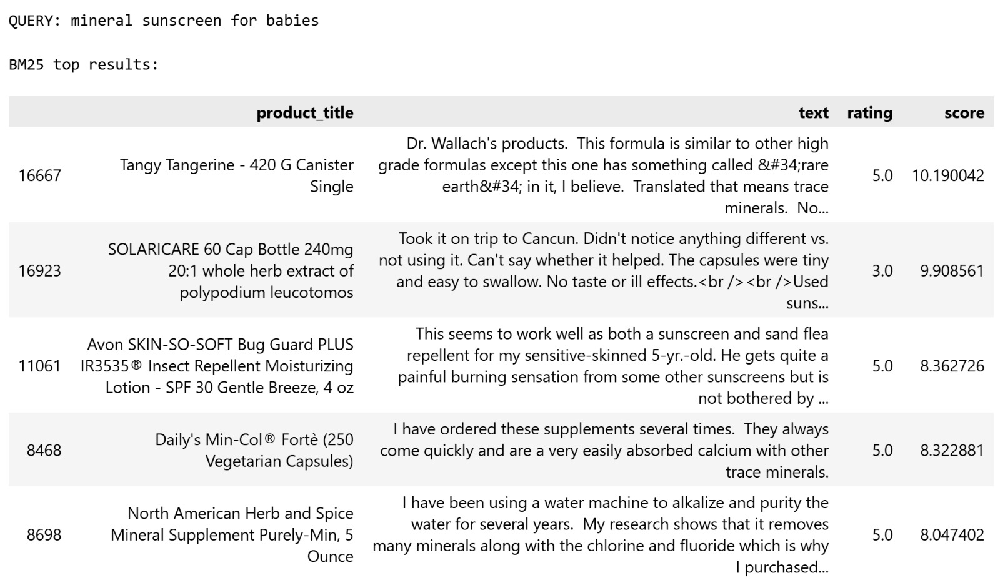
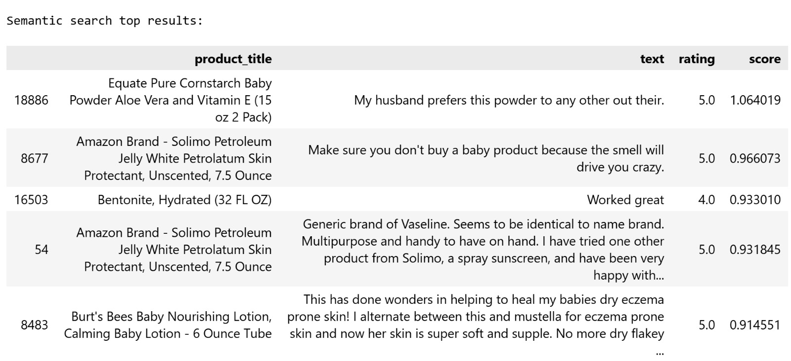
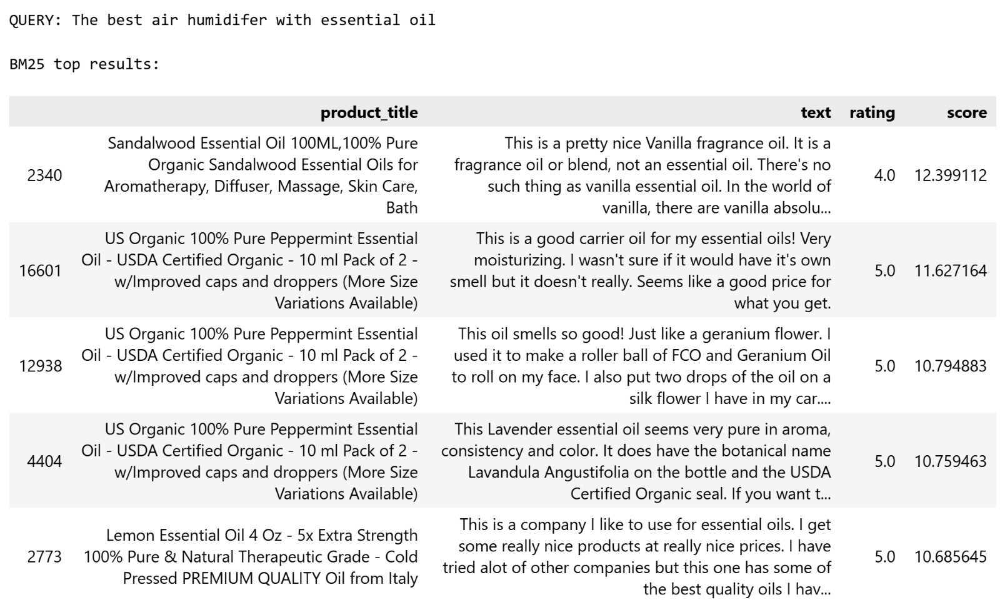
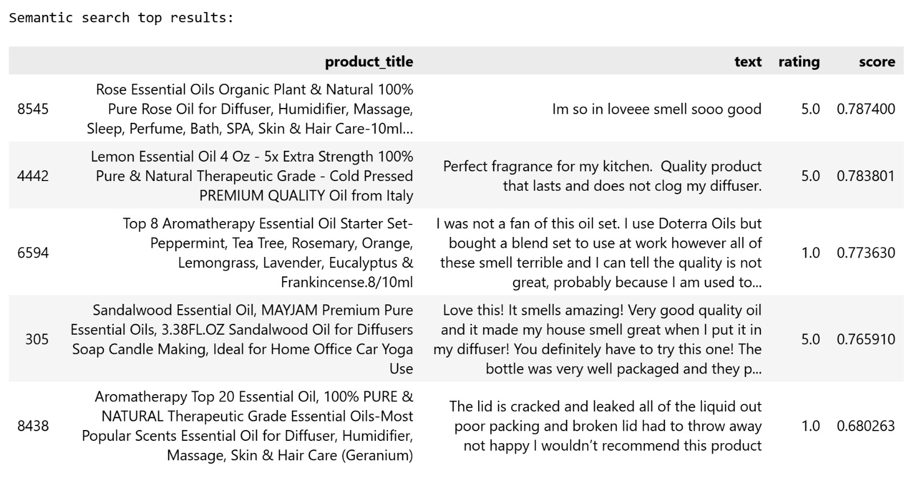
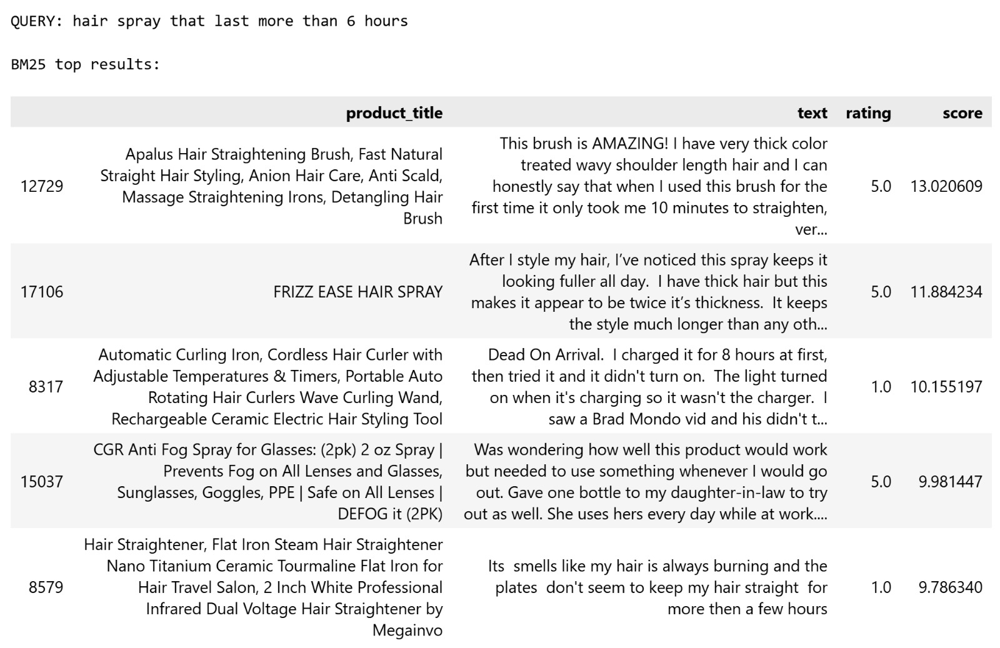
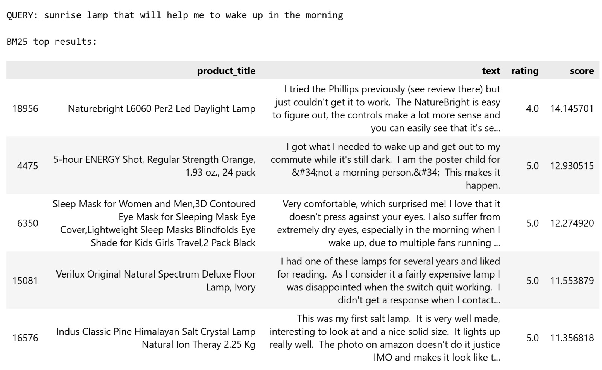
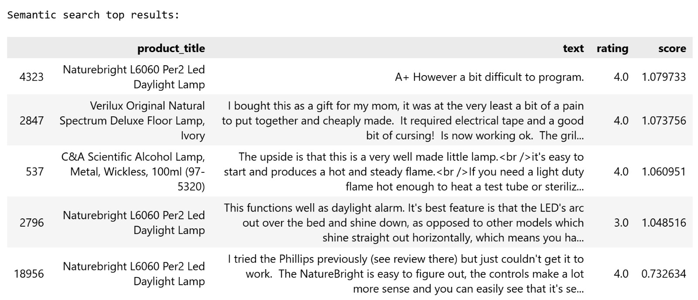

# Query Picks

### 1. QUERY: Bar Soap (Easy Query)

 

For this query, it seems that BM25 method is slightly better because the
top 2 results return relevant bar soap products (note that they're
duplicates) whereas the top 2 results for Semantic method are not
relevant (they are loofah soap instead of bar soap). Both methods seems
to confuse "bar soap" contained in reviews versus in the product title,
hence the mix up of loofah soap that comes with high scores (higher in
semantic). In BM25 the third and fifth result are not bar soap whereas
in semantic the first 2 and the fifth result are not bar soaps. Note
that the bar soap are for dish soap so it might not be what we thought
getting at first but it is relevant considering the query is not
specific of what bar soap is for.

### 2. QUERY: mineral sunscreen for babies (Medium Query)

 

Both methods seem to give irrelevant queries. None of them return
sunscreen products. It seems that for semantic search, the products are
relevant for babies but they are not sunscreens. We think that the
semantic method gives more relevant products than BM25 but still not
accurate. For the user's intent, none of the results are useful.

### 3. QUERY: The best air humidifer with essential oil (Hard Query)

 

The semantic method performs a little bit better since it gives 1 result
that is actually useful and relevant to the user's intent. Otherwise, it
seems that both method for this query do not perform well. They both
seems to mainly catch "essential oil" words and only give essential
products but not the humidifier. Most of the results are not useful for
the user's intent.

### 4. QUERY: hair spray that last more than 6 hours (Medium/Hard Query)

 

For BM25, there seems to be only 1 relevant hair spray products in the
second top result. On the other hand, semantic catch 2 relevant hair
spray products but places on the top 3 and 5 in the results. Other than
that, both methods seem to catch other products that are similar to hair
spray, so not accurate (e.g. hair curler, hair styling products). None
of the methods seem to catch any results with "last more than 6 hours".
For the user's intent, semantic might be better since it gives 2
relevant searches than BM24 that are useful.

### 5. QUERY: sunrise lamp that will help me to wake up in the morning (Medium/Hard Query)

 

The semantic method performs better for this query since it gives top
results all related to lamps whereas BM25 query gives only 1 relevant
search related to lamp and the rest are not lamps. However, both methods
are not perfect and accurate for the user's intent because even in
semantic search, the lamps are not exactly sunrise lamp that the user
wanted.

# Discussion for Overall Queries

The cases where BM25 fails but semantic search succeeds are hair spray
and lamp queries since the queries requires more semantic context. The
cases where semantic search fails in humidifier query since all the
results return essential oils but not the humidifier.

For simple (keyword) query, it seems that BM25 slightly perform better
because BM25 can catch exact keyword quite well. In other simple queries
in the notebook, we see that the performance would be similar for both
methods. For semantic query, the hair spray and lamp query shows the
case where the semantic model clearly perform better than BM25 and are
able to capture more semantic context. For complex query, the humidifier
query shows that both methods were not performing well.

# Summary

BM25 seems to be the best for keyword query but do not perform well for
semantic queries. On the other hand, semantic method is a better
performer in catching semantic queries and perform quite well in keyword
queries too (but for some keyword query, BM25 is better). For both
methods, complex queries and sometimes semantic queries are hard to
detect. In this case, advanced methods like RAG or reranking is helpful
for such complex search.
