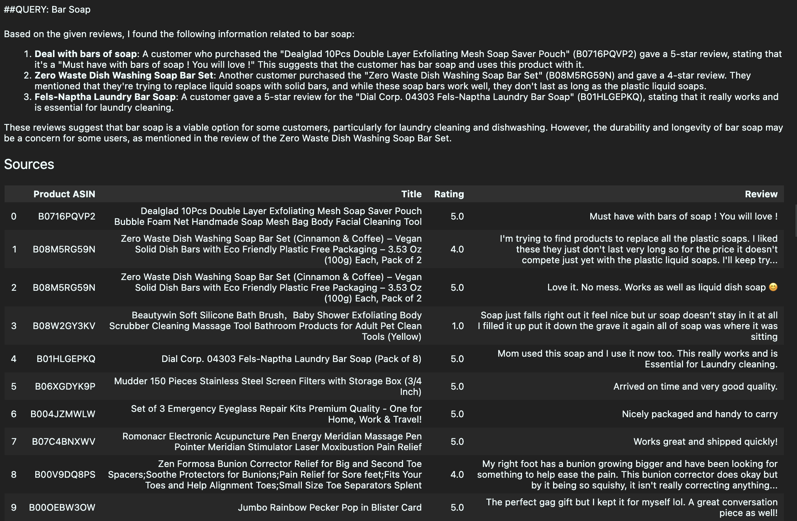
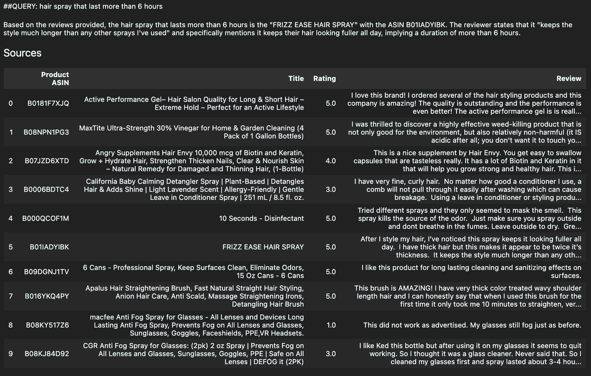
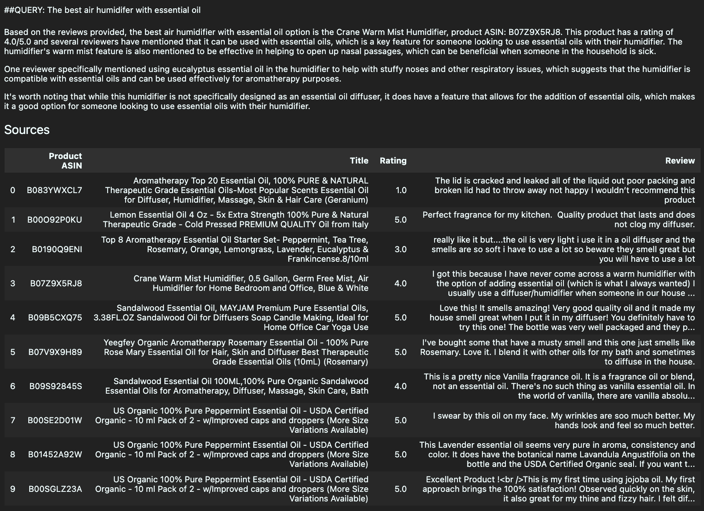
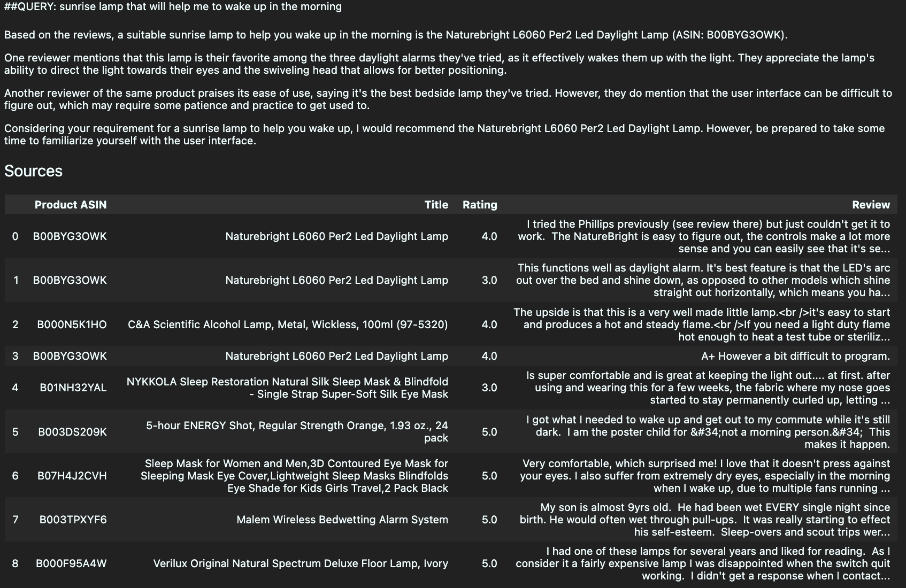
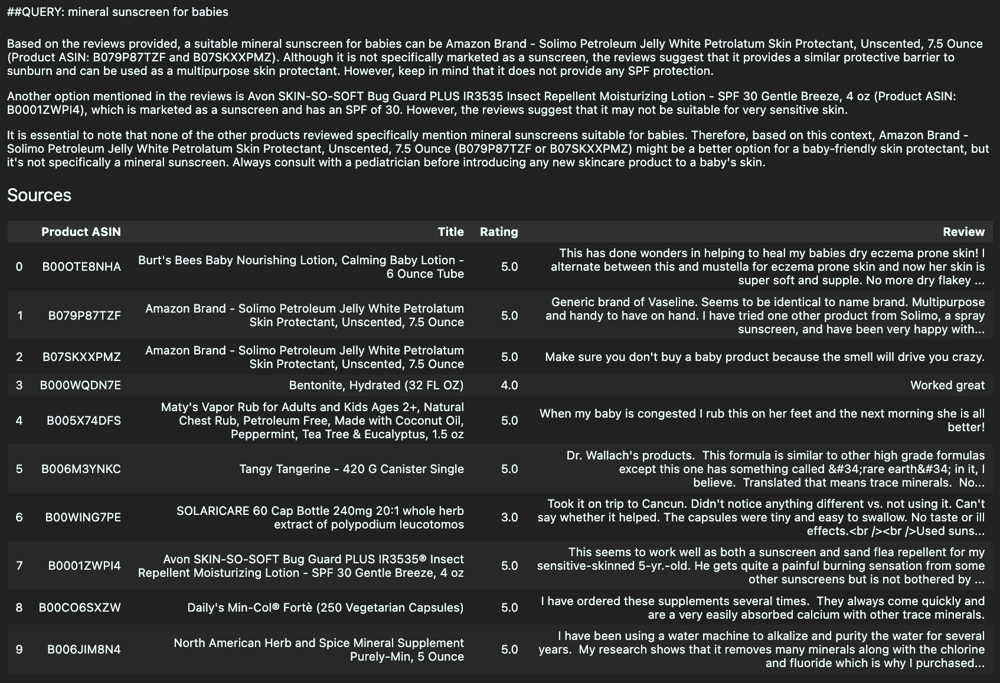

# Milestone 2 Discussion

## Step 1: Model Choice

We initially prototyped with Qwen3.5-0.8B as it is lightweight. However, the performance was poor (too many repeated text) and we switched to Meta-Llama-3-8B-Instruct via HuggingFace API without needing a lot of storage. Instruct models are tuned to follow instructions. We chose a 8B model as it is a good balance between performance and latency.

## Step 2.3: Prompts

Prompts tried: 
1. Default including instruction to follow context 
2. Just assigning a role without instruction to follow context 
3. Default and tell the model to be concise

The model was good at following the instructions of prompt 3 - responses were restricted to one line. Even though it was not explicitly stated in prompt 2, the model still restricted its responses to the context, possible because another part of the prompt stated "answer based on the reviews above".

## Step 5: Hybrid RAG Evaluation

Note: we use the original prompt for evaluation.

### Query 1: Bar Soap

In the "bar soap" query, the pipeline retrieved one irrelevant product (a mesh soap saver pouch) alongside two correctly matched bar soap products. This indicates that the retrieval stage occasionally surfaces loosely related items rather than exact matches. Despite this, the LLM showed some good reasoning by generating a helpful response like correctly acknowledging their specific use cases such as laundry cleaning.

| Dimension        | Rating |
|------------------|--------|
| **Accuracy**     | no     |
| **Completeness** | yes    |
| **Fluency**      | yes    |

### Query 2: hair spray that last more than 6 hours

For the hairspray, the pipeline demonstrated strong semantic retrieval, successfully identifying the FRIZZ EASE Hair Spray (B01IADYIBK) as the correct hairspray recommendation despite it not ranking first in the retrieved sources. The LLM showed impressive semantic understanding by picking up on the indirect cue of "hair looking fuller all day" to address the user's specific requirement of a hairspray lasting more than 6 hours, resulting in an accurate and well-reasoned answer.

| Dimension        | Rating |
|------------------|--------|
| **Accuracy**     | yes    |
| **Completeness** | yes    |
| **Fluency**      | yes    |

### Query 3: The best air humidifer with essential oil

For the humidifier query, RAG accurately recommended the Crane Warm Mist Humidifier (B07Z9X5RJ8) as the actual humidifier (no recommendations on just essential products). The LLM showed precise understanding of the reviews by correctly identifying that the humidifier supports essential oil addition. This was inferred from review context rather than explicit product descriptions, which directly addressed the user's query intent.

| Dimension        | Rating |
|------------------|--------|
| **Accuracy**     | yes    |
| **Completeness** | yes    |
| **Fluency**      | yes    |

### Query 4: sunrise lamp that will help me to wake up in the morning

For the Sunrise Lamp query, the pipeline performed well by accurately recommending the Daylight Lamp (B00BYG3OWK) as a suitable lamp for waking up with the light. This was shown as first two top choices in the sources table, indicating strong alignment between the retrieval and generation stages of the workflow.

| Dimension        | Rating |
|------------------|--------|
| **Accuracy**     | yes    |
| **Completeness** | yes    |
| **Fluency**      | yes    |

### Query 5: mineral sunscreen for babies

For sunscreen, the RAG pipeline struggled to recommend an actual sunscreen product, likely due to the corpus lacking sufficient sunscreen-specific products rather than a failure of the retrieval or generation logic. However, the LLM still demonstrated good contextual understanding by explicitly acknowledging that the recommended products were not true sunscreens and lacked SPF protection. Overall, the recommendations are not useful for the user.

| Dimension        | Rating |
|------------------|--------|
| **Accuracy**     | no     |
| **Completeness** | yes    |
| **Fluency**      | yes    |

### Discussion

**Key Observations & Overall Performance:**

Overall, the Hybrid RAG workflow performed well across most queries, demonstrating strong semantic understanding. For instance, correctly identifying the hair spray that last all day, the daylight lamp to wake up with light, and the humidifier that incorporate essential oil from indirect review cues. However, performance was limited in some cases, where the pipeline struggled with queries where the corpus lacked relevant products, such as the mineral sunscreen for babies. The LLM recommended loosely related products instead of acknowledging that no suitable product existed in the knowledge base, despite having good context of explaining related product to sunscreen (e.g. SPF related product). Additionally, the retrieval stage occasionally surfaced irrelevant products in the sources table, soap pouch appearing in the bar soap query, suggesting that the hybrid retriever weighs review text mentions too heavily over actual product titles.

**Limitations**

First, the RAG workflow lacks the ability to recognize when no relevant product exists in the corpus. Instead of honestly returning no result, it always attempts to recommend the closest match, which can lead to inaccurate and misleading recommendations as observed in the sunscreen query. Second, the retriever struggles to differentiate between a product's actual category and incidental mentions of keywords in review text. For example, "bar soap" appearing in a review does not mean the product itself is a bar soap, yet the pipeline treats both signals equally, introducing noise into the retrieved sources.

**Suggestions for Improvements**

One suggestion is to reweighing the hybrid retriever to prioritize product title matches over review text mentions would help the pipeline better distinguish actual product categories from incidental keyword mentions in reviews. Secondly, deduplicating the corpus to remove repeated product entries could reduce confusion in the LLM's reasoning, and reducing noise. Additionally, incorporating more structured product features such as product category metadata into the corpus could provide the LLM with richer context to better differentiate between products, reducing misclassification and improving recommendation relevance.
